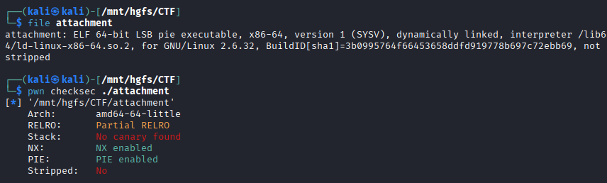
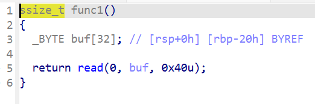
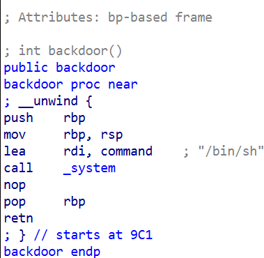
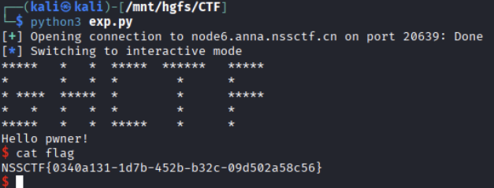

# [GHCTF 2025]Hello_world

## 基本信息

- 题目名称：[GHCTF 2025]Hello_world
- 题目链接：https://www.nssctf.cn/problem/6543
- 考点清单：PIE 保护、栈溢出、Partial overwrite局部覆写

## 一、看到什么

### 文件分析



- 64位 ELF可执行文件
- 无栈保护（无 canary）
- PIE保护开启 （地址随机化）
  
### IDA 分析



- 32 字节`buf` 可读 64 字节 -> 存在栈溢出漏洞
- 返回地址 offset = buf[32] + saved rbp[8] = 40 字节
  


- 存在 backdoor 函数
- backdoor 函数偏移 `0x9C1` 
- 目标：覆盖返回地址 控制流跳转到 backdoor 函数
  
## 二、想到什么解题思路

- PIE保护开启后 程序每次运行的基址改变 相对偏移不变
- Partial overwrite 低位字节局部覆写 让程序从原返回点跳转到 backdoor 地址
- 覆盖低位字节低位字节为 `0x9C1`（小端序 `\xC1\x09`）跳转到 backdoor 函数
- 小端序写入 `\xC1\x09` 高位保持不变

## 三、Payload

```python
from pwn import *
io = remote('node6.anna.nssctf.cn', 20639)

payload = b'A' * 40 + b'\xC1\x09'
io.sendline(payload)
io.interactive()
```



## 四、总结
**Partial overwrite（局部覆写）**  
- 在 PIE 条件下不泄露基址 直接通过修改低位字节实现控制流跳转
- PIE 开启后 程序基址随机 但函数之间的相对偏移不变
- 修改返回地址低位字节 高位保持不变 仍然会落在这次运行的 PIE 映射里